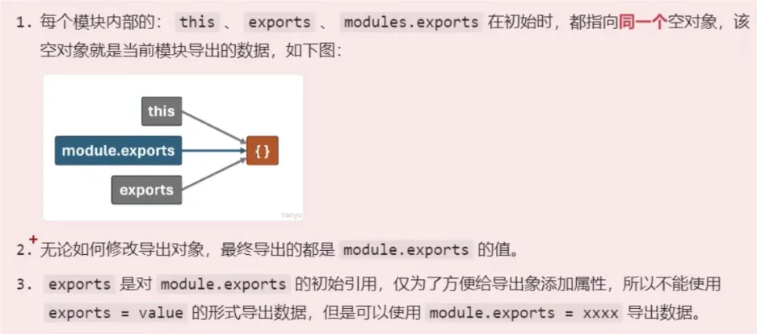

# 模块化

> 模块化是前端开发中一个重要的概念，它允许开发者将代码进行拆分，分别进行管理，提高代码的可维护性。

## 模块化规范
模块化有四种方式：
1. CommonJS(重点)
2. ES6(重点)
3. CMD
4. AMD

## CommonJS

CommonJS是Node.js的模块化规范，它将模块化视为一个对象，对象中包含一个或多个方法，通过`module.exports`导出模块，通过`require`引入模块。



```js{1,11}
index.js

// 引入school.js
const school = require('./school.js')

// 可以重名
const {name:schoolname} = require('./school.js')

console.log(school)

school.js

const name = "js是弱类型语言"
const information = "苦天下久矣"

function study (){
  return '我爱学习'
}

// 依次往下执行
exports = { a : 1 }  // 当前导出 { a : 1 }
exports.name = name  // 当前导出 { a : 1, name : "js是弱类型语言" }
module.export.b = 2  // 当前导出 { b : 2 }
module.exports = { information, study }  // 当前导出 { information : "苦天下久矣", study : Function }
```

## ES6

```js{1,26}
index.js

// 导入全部 --> 通用
import * as school from ('./school.js')

// 命名导入（导入时可以重命名） --> 适用于 分别导出 统一导出
import { name } from './school'
import { name as schoolname } from './school'

// 默认导入(可以自己起名)  --> 适用于 默认导出
import qwe from './school'

// 命名导入 和 默认导入 混用
import qwe, { name} from './school'

// 动态导入
btn.onclick = async()=>{
  const result = await import('./school')
}

// import 可以不接收任何数据
import './school'

console.log(school)

school.js

// 分别导出
export const name = "js是弱类型语言"
export const information = "苦天下久矣"
export function study (){
  return '我爱学习'
}

-------------------------------------------

// 统一导出
const name = "js是弱类型语言"
function study (){
  return '我爱学习'
}
// 类似于对象的结构
export {
  name, study
}  // 

-------------------------------------------

const name = "js是弱类型语言"
function study (){
  return '我爱学习'
}
// 默认导出
export default 900  // { default: 900 }
export default name  // { default: 'js是弱类型语言' }
export default { a: 1 , study }  // { default: { a : 1, study: Function} }

```
::: tip
在服务端运行（两种方法）
1. 当nodejs版本>=12以上时，修改js名称后缀为.mjs就可以在服务端运行
2. 在根目录package.json添加属性"type":"module"，即可运行
:::


## 数据引用问题

### CommonJS

```js
================ index.js ==============

const count = require('./data.js')

console.lg(count)  // 1
increment()  // 2
increment()  // 3
console.lg(count)  // 1


================ data.js ==============
let count = 1
function increment(){
  count += 1
  console.log(count)
}

module.exprots = { count, increment }
```

### ES6

```js
================ index.js ==============
import { count, str, increment } from './data.js'

console.lg(count)  // 1
increment()  // 2
increment()  // 3
console.lg(count)  // 3

str = "嘻嘻"
console.lg(str)  // 报错 Assignment to constant variable error

================ data.js ==============
export let count = 1
export function increment(){
  count += 1
  console.log(count)
}

export const str = "哈哈"
```
